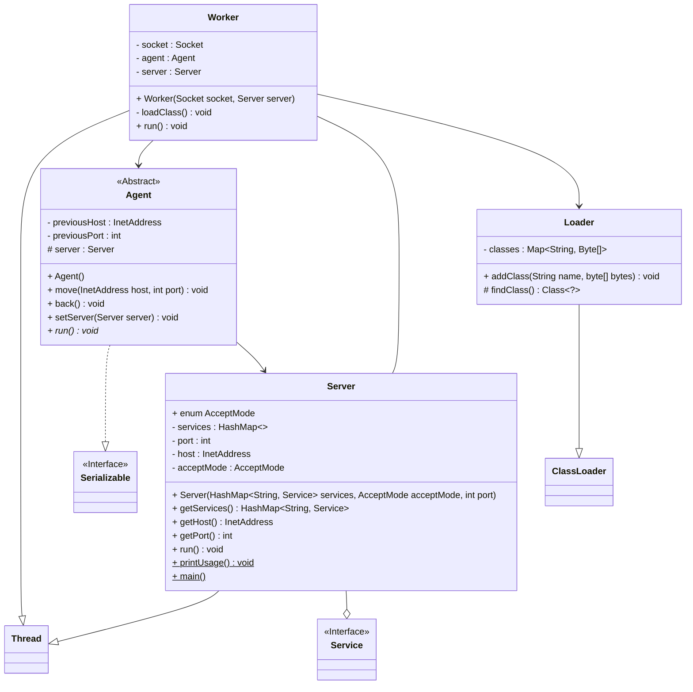

_Matteo Planchet and Aurélien Verbeke_
# Code structure

# Class export mechanism

### Sending the agent

_Done by `move()`_

We open a socket to the destination server. We send the class name, the class bytes (corresponding to the `.class`) and the serialized instance bytes.

### Receiving and executing the agent

The server accepts the socket connection and transmits it to a separate thread (called _worker_) whose role will be to execute the agent.

Then, the worker creates the class: it gets the class name, the class bytes (`.class`) and the serialized instance bytes, and loads it using a `ClassLoader`.  Finally, the worker runs the agent.

>[!info]
>The class bytes (`.class`) are loaded in a variable in the agent when initializing it. However, we cannot serialize a class containing class code, or we get an error due to the Java classes headers. Hence, we set this variable as `transient` (won't be serialized); the server needs to reassign the class code to the variable after loading the class. 

# Tests

We compare the mobile agent implementation with RMI.

For this, we created two very simple services:

1. A string generator service that generates random strings of length between 2 and 100.
2. A length calculator service that returns the length of a given string.

And we created two examples of mobile agents and two RMI clients:

1. The first example/mobile agent generates 10000 random strings by querying the string generator service, then for each string, it queries the length calculator service to get its length. Finally, it computes the sum of strings lengths.
2. The second example/mobile agent alternates 10000 times between the string generator and the length calculator. Finally, it also computes the sum of strings lengths.

We ran both examples with both implementations (mobile agents and RMI) and measured the execution time.

The results are below:
_Tested with all servers on forge.enseeiht.fr_

| Example number | Mobile agents execution time rough estimate | RMI execution time rough estimate |
| --- | --- | --- |
| 1 | 0.3s | 3s |
| 2 | 110s | 4s |

On the first example, it's logical that the mobile agents method is more efficient than RMI, because it minimizes the number of queries, and hence TCP connections and transfers.

On the second example, however, the number of queries and connections is the same. Each time, the agent needs to be serialized and sent through the network, which drastically increases the execution time.

As we work here on a single machine, the delay doesn't come from network, but only from importing / exporting data to / from the JVM.

# Conclusion

The mobile agent paradigm is very efficient when the number of distant queries is minimized, and when the amount of data to be transferred is small compared to the amount of computation to be done locally. 

However, when the amount of data to be transferred is large, or when the number of distant queries is high, the mobile agent paradigm can be less efficient than traditional remote method invocation.