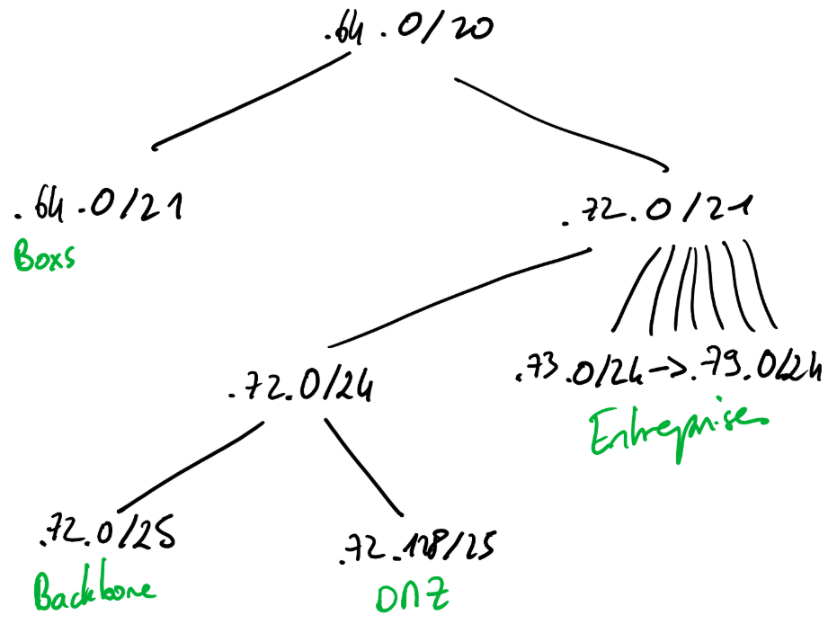

_Projet Interconnexion, 2025-2026_

_Groupe : Dubois Emmanuel, Mautin Oscar, Meyer Camille, Planchet Matteo, Verbeke Aurélien_

# Sommaire

-   Introduction
-   Choix
    -   Infrastructure physique
    -   Architecture globale
    -   Plages d'IP
    -   Services déployés
        -   Sous-réseau particulier
        -   Sous-réseau entreprise
        -   DMZ
-   Observations
-   Guide de mise en place
-   Répartition des tâches

# Introduction

Ce projet a pour but de mettre en place une architecture réseau sous la forme d'un AS, dans lequel on hébergera différents services à l'intérieur de divers sous-réseaux.

Ce rapport présentera les différents choix que nous avons réalisé lors de ce projet, à la fois au niveau de l'infrastructure physique ou au niveau de l'implémentation des services.

_Mots-clés : AS (Autonomous System)_

# Choix

## Infrastructure physique

Il a été décidé au début de ce projet de réaliser l'entièreté de l'AS sur des équipements physiques, en utilisant à la fois les ordinateurs présents dans les salles réseau de l'ENSEEIHT, des ordinateurs personnels, ainsi que des Raspberry Pi et un routeur empruntés à l'association net7.

Pour ne pas utiliser trop de machines physiques, nous avons choisi d'utiliser des network namespaces Linux pour quelques services de l'entreprise par exemple (VOIP, DNS, Minecraft) qui sont sur une machine physique unique (Tyrannosaure). Ainsi chacune des interfaces physiques de cette machine est associée à un namespace différent, simulant plusieurs machines physiques.

Ce choix a été fait afin de faciliter le travail individuel, la mise en commun ainsi que la résolution de problèmes. Chaque membre du projet a ainsi pu travailler sur sa partie individuellement, puis n'a eu qu'à connecter les équipements sur lesquels il a travaillé au réseau lors de sessions communes afin de vérifier le bon fonctionnement global.

Afin de ne pas modifier la configuration des équipements des salles réseau et pour faciliter le déploiement à chaque séance, chaque membre a préparé les fichiers de configuration des différents équipements et a rédigé des scripts permettant la configuration rapide des équipements.

Les paquets et logiciels supplémentaires non disponibles sur les machines de l'ENSEEIHT ont été téléchargés à l'avance (`apt install --download-only`) et sont installés lors du lancement des scripts (`dpkg -i *.deb`). Ainsi nous n'avons pas besoin d'une connexion internet pour déployer notre infrastructure.

## Architecture globale

Pour l'architecture globale, comme la majorité des services ne seraient accessibles qu'aux employés de l'entreprise, ils ont tous (sauf le serveur DNS global et le serveur DHCP du sous-réseau particulier) été positionnés dans le sous-réseau entreprise directement.

Il a été décidé de déployer un serveur DHCP à la base des réseaux domestiques afin de faciliter l'ajout de nouveaux réseaux domestiques à notre AS.

Egalement, nous avons décidé de rajouter un routeur Wi-Fi dans la zone d'entreprise afin de pouvoir réaliser des appels VoIP depuis des clients installés sur téléphone.

## Plages d'IP

Les adresses sont distribuées selon le plan suivant :

Notre AS utilise la plage d'adresses `120.0.64.0/20`, découpée en deux sous-réseaux principaux :

-   Le sous-réseau particulier `120.0.64.0/21`
-   Le sous-réseau entreprises + AS `120.0.72.0/21`

Dans le sous-réseau entreprises, nous pouvons accueillir 7 entreprises différentes, chacune disposant de la plage `120.0.X.0/24` (avec X variant de 73 à 79).

Pour l'infrastructure propre à l'AS, nous avons 2 sous-réseaux :

-   Le sous-réseau backbone `120.0.72.0/25`
-   Le sous-réseau DMZ `120.0.72.128/25`

## Services déployés

### Sous-réseau particulier

Dans le sous-réseau particulier, on retrouve un serveur DHCP s'occupant de l'adressage et du routage dynamique des différentes box de particuliers. Ceci permet l'ajout simple et rapide de nouveaux réseaux domestiques.

> [!warning]
> Les box se connectant au serveur DHCP doivent effectuer l'adressage et le masquage de leur réseau domestique (privé).

### Sous-réseau entreprise

Dans le sous-réseau entreprise, on retrouve plusieurs services :

-   Un serveur VPN,
-   Un serveur LDAP,
-   Un serveur VoIP,
-   Un serveur DNS,
-   Un serveur Minecraft,
-   Ainsi qu'un routeur Wi-Fi utilisant TP-Link

#### VPN (Pteranodon)

Le serveur VPN permet aux employés de l'entreprise de se connecter depuis leur machine personnelle au réseau de l'entreprise. Ce serveur utilise WireGuard, un protocole VPN qui, en plus d'être simple à mettre en place, est utilisable sur différents systèmes d'exploitations, ce qui permet une meilleure flexibilité pour les particuliers. Pour notre projet, nous avons configuré le serveur dans un environnement Linux, et le client dans un environnement Windows.

#### LDAP (Diplodocus)

Le LDAP (_Lightweight Directory Access Protocol_) fournit un annuaire. On peut y renseigner des personnes, des machines, des groupes...qui sont architecturés en arborescence.

On utilise le service OpenLDAP auquel on a ajouté une interface web (`phpLDAPadmin`) qui facilite l'ajout, la modification ou la suppression d'entrées à l'annuaire.

#### VoIP (Dilophosaure)

Le service VoIP (_Voice over IP_) permet de passer des appels téléphoniques via le réseau IP dans l'entreprise. On utilise le service `Asterisk` pour mettre en place un standard téléphonique avec le protocole `SIP` (_Session Initiation Protocol_).

Les comptes utilisateurs sont actuellement définis en dur dans la configuration d'Asterisk, mais ils pourraient être liés à l'annuaire LDAP pour une gestion centralisée des utilisateurs.

#### DNS (Velociraptor & Oviraptor)

Un serveur DNS permet (entre autres) d'associer des noms à différentes adresses IP, et donc différentes machines. Il permet aux utilisateurs de faire appel à des services ou équipements sans connaitre leur adresse IP.

Le DNS Oviraptor résout les noms de tvn7osaure, can7osaure, TRosaure, net7osaure, les différentes zones de notre réseau.

Le DNS Velociraptor permet d'accéder aux différents services de l'entreprise tvn7 tels que dilophosaure, triceratops, diplodocus, pteranodon.

Ainsi, les 2 DNS communiquent entre eux pour résoudre les appels aux services de l'entreprise qui se trouvent dans la zone tvn7 : Oviraptor renvoie la requête aux services particuliers à Velociraptor qui résout le nom.

On utilise le service `Bind9` par soucis de simplicité.

On définit deux noms de domaine :

-   `tour.radio` : utilisé par l'AS
-   `tvn7.fr` : utilisé par l'entreprise

#### Minecraft (Triceratops)

Un serveur Minecraft permet aux employés de l'entreprise de se détendre en jouant à Minecraft entre collègues _sur leurs heures de pause_.

#### Routeur Wi-Fi

Le routeur Wi-Fi permet aux appareils ne possédant pas de port Ethernet (typiquement, un téléphone portable) de se connecter au réseau de l'entreprise et d'accéder aux services proposés, notamment pour utiliser le VoIP.

# Observations

Tous les services implémentés sont fonctionnels, cependant aucun filtrage n'est implémenté pour le moment, donc les services sont accessibles par n'importe quel particulier, qu'il soit connecté au VPN ou non.

De plus, actuellement l'authentification au niveau des différents services est codée en dur dans les services. Une amélioration possible pourrait être de centraliser l'authentification grâce au LDAP pour le serveur VPN, le serveur VoIP, et même le serveur Minecraft.

# Guide de mise en place

Afin de mettre en place notre AS, il suffit de récupérer les fichiers de configuration des différentes machines et de connecter les différentes machines conformément au plan réseau. 

En utilisant les fichiers de configuration et les scripts d'initialisation, les différents services devraient pouvoir se lancer proprement, sauf pour le VPN dont les couples de clés devront possiblement être générés à nouveau afin d'ajouter un nouveau particulier.

# Répartition des tâches

-   Plan réseau : _Aurélien Verbeke_
-   Déploiement de la backbone : _Oscar Mautin_
-   Mise en place du réseau de particuliers : _Aurélien Verbeke_
-   Mise en place des serveur DNS : _Camille Meyer, Aurélien Verbeke_
-   Mise en place des services d'entreprise (VoIP, Minecraft) : _Matteo Planchet_
-   Mise en place du VPN entreprise : _Emmanuel Dubois_
-   Mise en place du LDAP : _Aurélien Verbeke_

> [!info]
> Certaines tâches n'ont pas été indiquées (réflexion sur l'adressage, rapport) car elles ont été réalisées communément par tous les membres du groupe.
