Aurélien VERBEKE et Matteo PLANCHET

2025-2026

# TP1

| Charge ($\rho$) | 0.3 | 0.6  | 0.9  |
| ---------- | --- | ---- | ---- |
| $\lambda$ = $\mu$ \* $\rho$ | 9,9 | 18,8 | 27,7 |

## File M/M/1

### Résultats analytiques

|                    | 0.3   | 0.6   | 0.9   |
| ------------------ | ----- | ----- | ----- |
| E[L] = $\rho$ / (1 - $\rho$) | 0,427 | 1,500 | 9,000 |
| E[R] = E[L] / $\lambda$    | 0,043 | 0,080 | 0,325 |

### Résultats obtenus par simulation

|                 | 0.3           | 0.6           | 0.9           |
| --------------- | ------------- | ------------- | ------------- |
| E[L] (T=10000s) | 0,472 ± 0,018 | 1,649 ± 0,044 | 9,630 ± 0,200 |
| E[L] (T=1000s)  | 0,492 ± 0,057 | 1,652 ± 0,137 | 9,530 ± 0,681 |
| E[R] (T=10000s) | 0,045 ± 0,003 | 0,080 ± 0,003 | 0,302 ± 0,001 |
| E[R] (T=1000s)  | 0,046 ± 0,001 | 0,078 ± 0,001 | 0,300 ± 0,004 |

### Commentaires sur la précision des résultats

La plupart des résultats simulés que nous observons ici ne correspondent pas aux résultats théoriques. Il est même à noter que pour $\rho$=0,9, plus nous prenons un temps de simulation long, plus nous nous écartons de la valeur théorique, et ce avec une précision qui augmente. Cela peut notamment provenir de l'accumulation d'erreurs lors de la simulation.

Cependant, à part pour E[L] (T=1000s) et E[R] (T=10000s, $\rho$=0,3), nous avons $\frac{\text{intervalle de confiance}}{\text{valeur moyenne}} \le 7\%$, ce qui indique des résultats précis.

## File M/D/1

### Résultats analytiques

|                                  | 0.3   | 0.6   | 0.9   |
| -------------------------------- | ----- | ----- | ----- |
| E[L] = $\rho$(2 - $\rho$) / (2 \* (1 - $\rho$)) | 0,364 | 1,050 | 4,950 |
| E[R] = E[L] / $\lambda$                  | 0,037 | 0,056 | 0,179 |

### Résultats obtenus par simulation

|                 | 0.3           | 0.6           | 0.9           |
| --------------- | ------------- | ------------- | ------------- |
| E[L] (T=10000s) | 0,366 ± 0,012 | 1,062 ± 0,024 | 5,123 ± 0,100 |
| E[R] (T=10000s) | 0,037 ± 0,000 | 0,053 ± 0,000 | 0,172 ± 0,001 |

### Commentaires sur la précision des résultats entre les deux files

Là encore, les résultats sont très précis, en particulier pour l'estimation du temps de réponse : $\frac{\text{intervalle de confiance}}{\text{valeur moyenne}} \le 6\%$. Cette fois ci cependant, et ce en particulier pour l'estimation de la taille de la file, nos résultats collent beaucoup plus aux résultats attendus. Ce n'est pas étonnant puis la constance dans la taille des paquets assure un calcul des moyennes plus stable.

## Files de taille finie

### Probabilité de rejet

<!--
$$
\Pi_K =
\begin{cases}
\dfrac{\rho^K (1-\rho)}{1-\rho^{K+1}} & \text{si } \rho < 1 \\
\dfrac{1}{K+1} & \text{si } \rho = 1
\end{cases}
$$
-->

Probabilité de rejet pour K=2, $\lambda$=20, $\mu$=33, paquets exponentiels : 13%

Probabilité de rejet pour K=2, $\lambda$=20, $\mu$=33, paquets constants : 6%

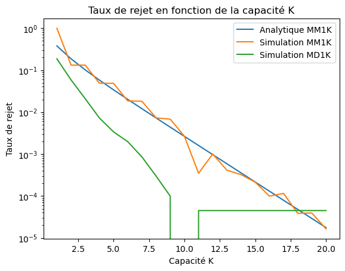

## Simulation d'un système composé de deux noeuds de commutation

### Temps de réponse

Dans le cas où la source et la destination sont séparées par un nœud de commutation, le paquet traverse deux files en série identiques. Le temps de réponse total est alors la somme des temps de réponse de chaque nœud. Ainsi, en régime stationnaire et si les files sont indépendantes, le temps de réponse moyen du système est simplement doublé par rapport au cas à un seul nœud, soit E[R total]=2E[R], que ce soit pour des paquets de taille exponentiellement distribuée ou constante.

1. La loi d'arrivée des paquets de la 2ème file est la même que celle de la première file, une loi Poisson de paramètre $\lambda$, selon le théorème de Burke.

2. On observe que le temps de réponse du premier serveur est d'environ ~0.25 et celui du deuxième serveur est d’environ ~0.15. Sur une durée plus longue (2000 ticks), les estimations se stabilisent, mais il y a toujours un écart dû à la durée finie de la simulation et à l’initialisation du système à vide.

3. En simulation, la première file M/D/1 se stabilise vers ~0.2, tandis que la deuxième file reste quasi constante autour de ~0.03. Ce comportement s’explique par le service déterministe : il réduit fortement la variabilité du flux de sortie de la première file. La deuxième file reçoit donc un flux très régulier (presque périodique), ce qui limite les congestions et rend son temps de réponse très faible et stable.

# TP2 : Méthodes d'accès Aloha

## 1. Validation de la charge analytique

On fait varier le nombre de noeuds {100, 150, 200} et on trace la charge utile G en fonction de la charge du système rho.

| 100 noeuds | 150 noeuds | 200 noeuds |
| --- | --- | --- |
| 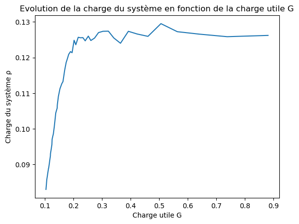 | 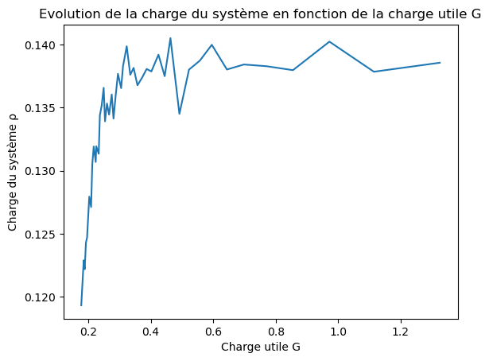 | 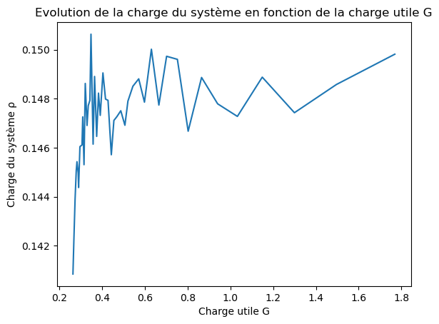 |

## 2. Optimisation du temps de backoff

On fixe idle_time = 0.17 => G = 1/2 et on trace le mean backoff time en fonction de la charge du système rho_s et de la moyenne de temps de réponse E_r.
On observe un maximum de charge en sortie de 0.163 et un minimum de temps de réponse de 19.2s pour un temps de backoff de 0.05s

| $E[R]$ | $\rho_S$ |
| --- | --- |
| 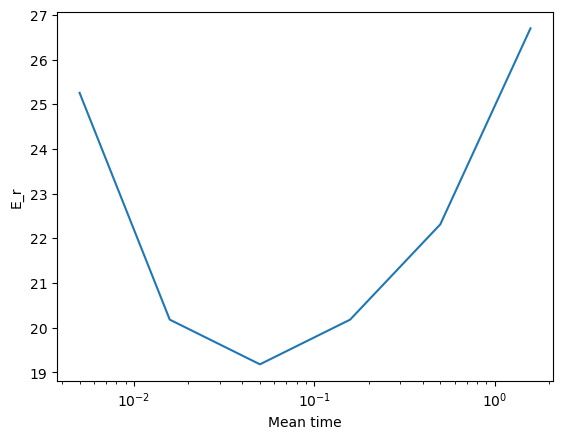{width=100%} | 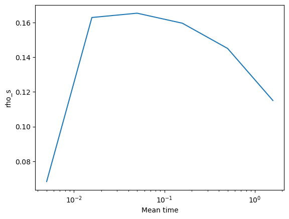{width=100%} |

## 3. Influence du nombre de noeuds sur la charge en sortie

Notre valeur de mean backoff optimale est donc de 0.05s, on fait varier le nombre de noeuds de 10 à 250 et on trace la charge en sortie rho_s en fonction de la charge du système rho.

On observe que la charge est sortie est maximale pour un nombre de noeuds de 125, avec une charge maximale de 0.163, ce qui correspond à notre résultat précédent.

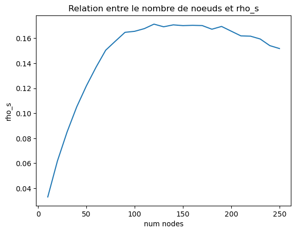

## Conclusion

La théorie nous dit que la charge maximale est atteint pour G = 1/2 et vaut 0.18. Nos résultats expérimentaux montrent que la charge maximale est atteinte pour G = 1/2 et vaut 0.163, ce qui est proche de la valeur théorique.

La différence peut être expliquée par le fait que notre simulation est basée sur des approximations et des hypothèses qui ne sont pas forcément vérifiées dans la réalité. Par exemple, nous avons supposé que les temps de backoff sont indépendants et identiquement distribués, ce qui n'est pas forcément le cas dans la réalité.

# TP3 : Etude de la surcharge sur les réseaux d'accès sans fil

## 1. Introduction

1. La méthode d'accès la plus basique est Aloha.
2. Deux variantes de Aloha existent : Pure Aloha et Slotted Aloha. Pour Pure Aloha, la formule qui exprime le débit $S$ en fonction de la charge $G$ du système est
   $$S = G \cdot e^{-2G}$$
   Pour Slotted Aloha, la formule est
   $$S = G \cdot e^{-G}$$
3. Tracé de $S$ en fonction de $G$ pour les deux méthodes d'accès :

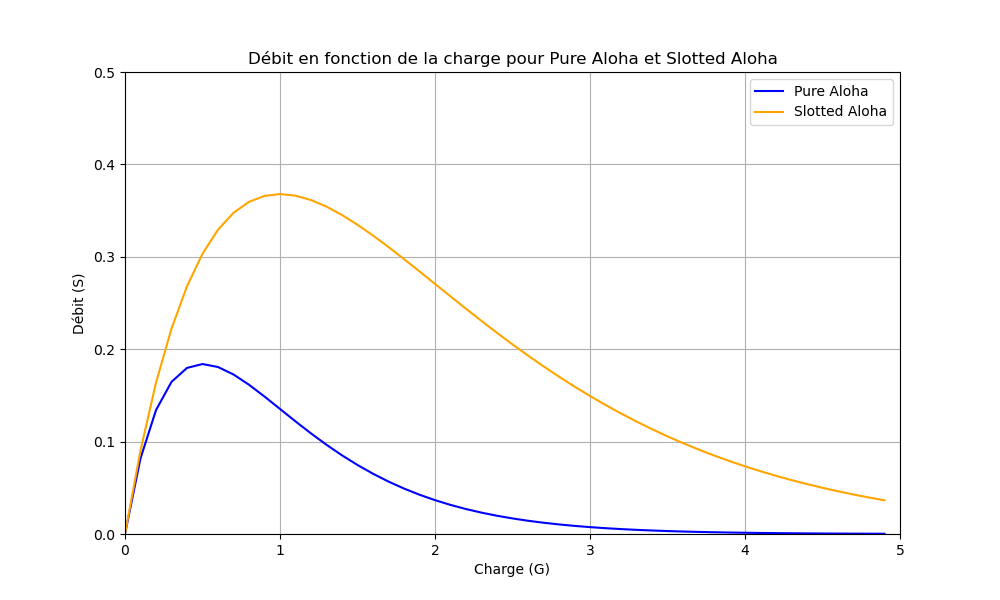

4. On a trouvé Grant-Free Random Access (GFRA) qui est une méthode d'accès aléatoire sans réservation. Elle permet aux utilisateurs de transmettre des données sans attendre une autorisation préalable, ce qui peut réduire la latence et améliorer l'efficacité du réseau dans certaines situations. Cependant, elle peut également entraîner des collisions et une surcharge du réseau si de nombreux utilisateurs tentent de transmettre en même temps.

Sources : Grant-Free Random Access in Machine-Type
Communication: Approaches and Challenges https://arxiv.org/pdf/2012.10550, Sparse Signal Processing for Grant-Free Massive Connectivity: A Future Paradigm for Random Access Protocols in the Internet of Things https://ieeexplore-ieee-org.gorgone.univ-toulouse.fr/document/8454392

## 2. Modélisation simple d'un réseau d'accès 4G

### 2.1 Abstraction couche physique

1. Le 3GPP a choisi la méthode d'accès Aloha Slotté parmis d'autre pour la 4G car elle est simple à implémenter et n'est pas en écoute permanente, ce qui permet de réduire la consommation d'énergie des appareils mobiles. De plus, elle offre une meilleure performance que Pure Aloha en termes de débit maximal et de tolérance aux collisions.
2. Le packet loss ratio (PLR) de Aloha Slotté avec $n$ codes orthogonaux et une charge $G$ est donné par la formule suivante :
   $$PLR = 1 - e^{-\frac{G}{n}}$$
3. Au maximum par time slot, la station de base peut recevoir

$$G_max = n \cdot \exp(-1)$$

### 2.2 Abstraction couche MAC

1.

- Le délai de traitement est constant
- Les ressources attribués à l’utilisateur sont envoyés avec l’acquittement

2. L'intérêt est que tous les utilisateurs ne transmettent pas tous en même temps.

3. Si au bout de 10 tentatives l'utilisateur ne reçoit pas d'acquittement, c'est probablement qu'il y a un problème ailleurs et cela ne sert à rien de continuer à retransmettre indéfiniment.

### 2.4

1. D'après la théorie pour $n=54$, le débit maximal est atteint pour une charge de $G = 54 \cdot e^{-1} \approx 19.9$. On a bien cette valeur dans la simulation, où à G=19, le système est stable et à G=20, il devient instable.

| Débit pour G = 19 | Débit pour G = 20 |
|-------------------|-------------------|
| 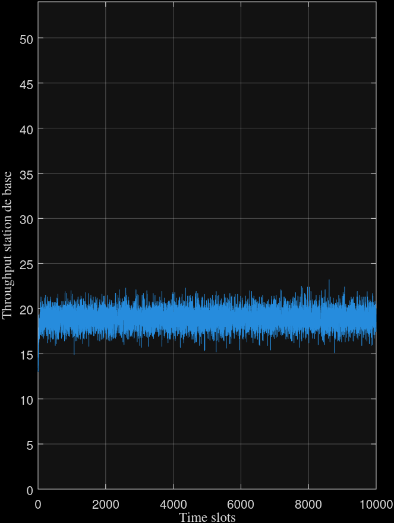 | 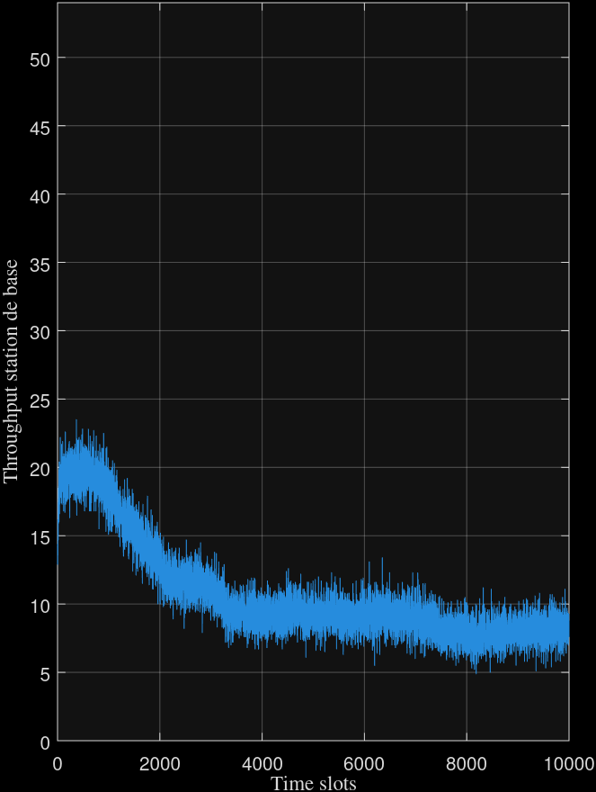 |

2. En enlevant le backoff aléatoire, on remarque que le système devient instable plus rapidement.

| Utilisateurs patients | Utilisateurs impatients |
|----------------------|-------------------------|
| 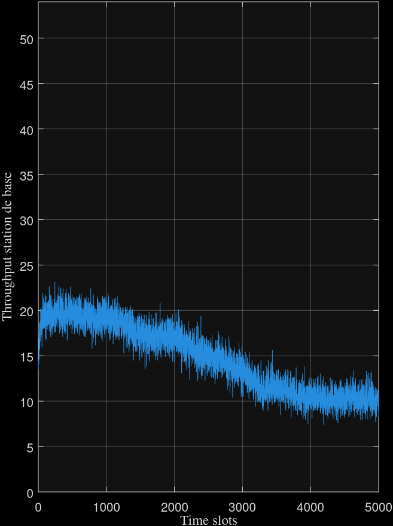 | 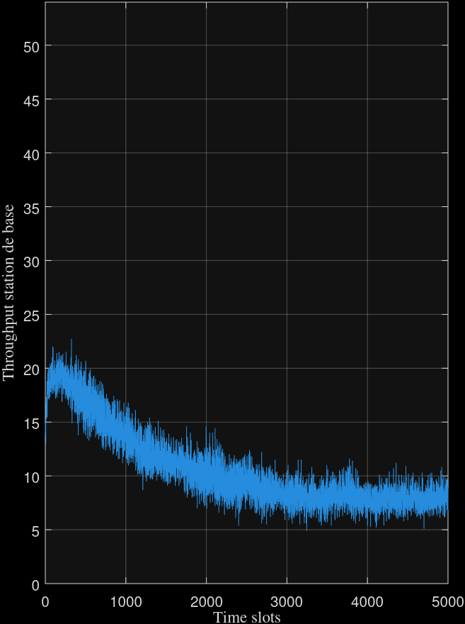 |

3. Si la station de base couvre une zone large, beaucoup d'utilisateurs vont s'y connecter. Alors, on peut dépasser la charge maximale admissible et beaucoup d'utilisateurs n'arriveront jamais à accéder au réseau.

## 3. Introduction au contrôle de charge

### 3.3

1. Pour évaluer les performances du contrôle de charge, on peut mesurer le débit du réseau, le taux de collision, et le temps d'accès moyen pour les utilisateurs. On peut également comparer ces métriques avec et sans contrôle de charge pour voir l'impact de ce mécanisme.
2. En diminuant $p_{access}$, on a tendance à bloquer plus d'utilisateurs, ce qui peut réduire le taux de collision et améliorer le débit pour les utilisateurs qui sont autorisés à accéder au réseau. Cependant, cela peut également augmenter le temps d'accès moyen pour les utilisateurs, car ils doivent attendre plus longtemps pour être autorisés à transmettre. En augmentant $N_{Slot Barring}$, on peut réduire le taux de collision en limitant le nombre d'utilisateurs qui peuvent accéder au réseau à un moment donné. Cependant, cela peut également augmenter le temps d'accès moyen pour les utilisateurs, car ils doivent attendre plus longtemps pour être autorisés à transmettre.
3. En expérimentant plusieurs couple de valeurs, nous avons trouvé que l'on a de meilleures performances avec $p_{access} = 0.75$ et $N_{Slot Barring} = 150$ avec le scénario donné. (Voir les graphiques ci-dessous)

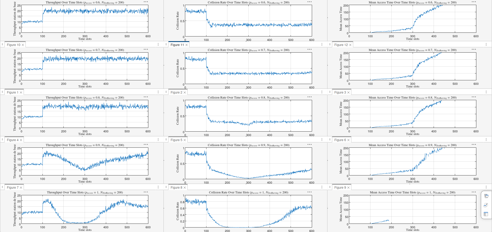

\_

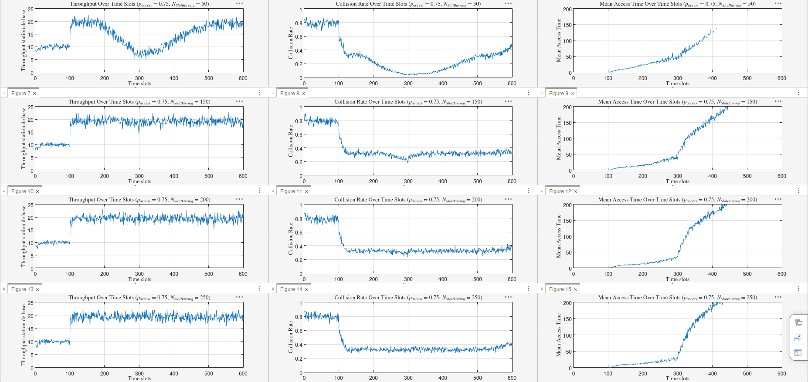
